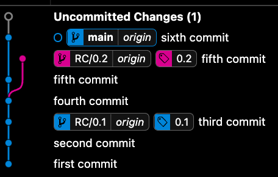

# Sample of trunk based development

fifth commit is hotfix



Every time a new RC is generated the docker image must be build with 
```bash
docker build -t my-app:`git rev-parse --short HEAD` .
```
this will tag the docker image with the short sha of 7 charcater of the last commit of the release candidate.

